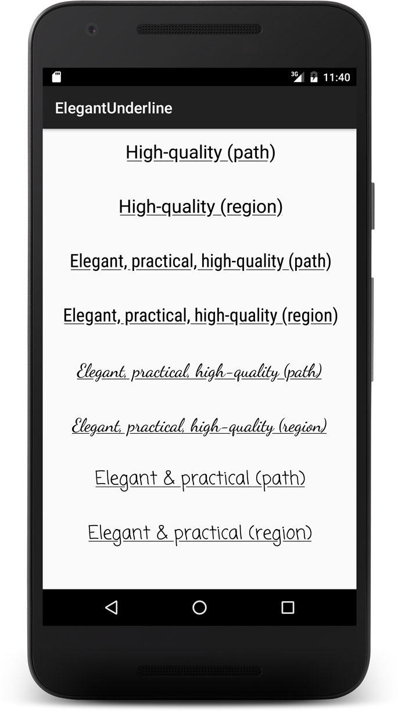

Elegant Underline
========

Copyright 2016 Romain Guy
[http://www.curious-creature.com](http://www.curious-creature.com)

Elegant Underline is a sample Android application that shows how to create better
underline text decorations. For more information, please refer to
[A better underline for Android](https://medium.com/@romainguy/a-better-underline-for-android-90ba3a2e4fb#.v4xblse45).

This sample application exposes two possible implementations:

* A `Path`-based implementation that requires API level 19
* A `Region`-based implementation that requires API level 1

License
===================

This project is subject to the [Apache License, Version 2.0](http://apache.org/licenses/LICENSE-2.0.html).
